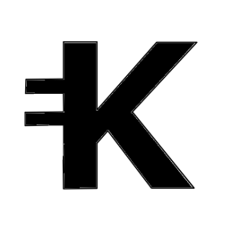

#  Klaro GUI Miner

The Klaro GUI miner is a beautiful, easy to use, interface for mining Klaro.
It is aimed at getting people that have never mined Klaro into the crypto
game by making it really simple to get started.

<!--  -->

We currently support two very popular miner backends:

1. [xmr-stak](https://github.com)
2. [xmrig](https://github.com)

## Compiling

### Linux

The miner GUI is built using [Electron](https://electronjs.org) and
[Go](https://golang.org) using the
[Astilectron app framework](https://github.com/asticode/astilectron).

* Install Go

[https://golang.org/dl/](https://golang.org/dl/)

* Install required Go packages

```shell
go get -u github.com/asticode/go-astilectron
go get -u github.com/asticode/go-astilectron-bundler/...
go get -u github.com/asticode/go-astichartjs
go get -u github.com/asticode/go-astilectron-bootstrap
go get -u github.com/google/uuid
go get -u github.com/mitchellh/go-ps
```

* Clone and build the app

```shell
git clone git@github.com:pranavms13/Klaro-GUI-miner.git pranavms13/Klaro-GUI-miner
cd pranavms13/Klaro-GUI-miner
make
```

NOTE: Ensure you clone the GUI miner into your working $GOPATH

If all goes well the binaries for Windows, macOS and Linux will be available in the `bin` folder.

## Credits
This project was originally developed by the [Stellite](https://github.com/stellitecoin/GUI-miner) ( now Scala ) team.